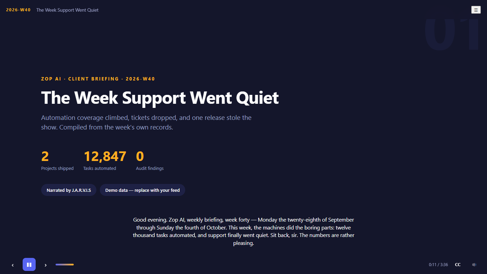

# Zop AI — Animated Weekly Reports

An animated, narrated, interactive weekly report that plays in any browser — no frameworks, no build step, no dependencies. Drop in one JSON file per week, run one command, and the report is ready: J.A.R.V.I.S narration, animated charts, interactive navigation.

**The player is pure vanilla HTML/CSS/JS** — it runs fast on old machines, hosts free on GitHub Pages, and anyone can download the folder and open it.



## Quickstart

```bash
# 1. Preview the demo week (any static server works)
npm run serve            # → http://localhost:8080

# 2. Generate a new week from the template
npm run new-week -- 2026-W41

# 3. Edit data/weeks/2026-W41.json, then build narration + validate
npm run generate -- 2026-W41
```

Open a specific week with `http://localhost:8080/?week=2026-W41`.

## What you get

- **Scene-based playback** — the report plays like a briefing: title → scoreboard → build board → charts → timeline → wins & blockers → outlook → outro.
- **J.A.R.V.I.S narration** — MP3s generated with edge-tts (`en-GB-RyanNeural`) plus a duration manifest for exact pacing. No MP3s? The player falls back to the browser's built-in voices automatically.
- **Interactive controls** — play/pause, next/previous, clickable progress bar, scene menu (☰), captions (C), mute (M), keyboard navigation (← → Space Home End).
- **Animated data** — counting numbers, growing bars, draw-on line charts, sweep-in donuts, all hand-rolled SVG. Respects `prefers-reduced-motion`.
- **Fully automated pipeline** — validate → narrate → play. The generator never hard-fails: missing audio toolchain degrades to browser voices.

## Controls

| Key | Action |
| --- | --- |
| Space / Enter | Play / pause |
| ← / → | Previous / next scene |
| Home / End | First / last scene |
| M | Mute narration |
| C | Toggle captions |
| Esc | Close scene menu |

## Authoring a week

One JSON file per week in `data/weeks/`. Full field reference in [docs/authoring-guide.md](docs/authoring-guide.md). Sketch:

```json
{
  "week": "2026-W41",
  "title": "The Week the Pipeline Sang",
  "period": { "start": "2026-10-05", "end": "2026-10-11" },
  "sections": [
    { "type": "title", "title": "...", "narration": "Spoken by J.A.R.V.I.S..." },
    { "type": "scoreboard", "metrics": [{ "label": "Tickets", "value": 214, "delta": "−31%" }] },
    { "type": "chart", "chart": { "kind": "bar", "labels": ["Mon", "Tue"], "series": [{ "name": "Tickets", "values": [58, 41] }] } }
  ]
}
```

Section types: `title`, `scoreboard`, `projects`, `chart` (bar/line/donut), `timeline`, `winsBlockers`, `outlook`, `outro`. Adding a new type = one renderer file in `player/sections/` + one line in its registry.

The generator validates your JSON with friendly errors before anything runs.

```bash
npm run generate -- 2026-W41 --skip-tts   # validate + skip audio
```

## How narration works

1. `npm run generate -- <week>` reads each section's `narration` text.
2. It synthesizes MP3s with edge-tts via the J.A.R.V.I.S venv (voice `en-GB-RyanNeural`) into `audio/<week>/`.
3. It writes `audio/<week>/manifest.json` with each scene's real duration, so scene pacing is exact.
4. The player prefers those MP3s; when missing it uses SpeechSynthesis (picks a British voice when available). Either way captions are one keystroke away.

Narration scripts follow the **voiceover-scriptwriting** rules: write for the ear, numbers as drama, one idea per sentence — boring narration is a defect.

## Architecture

```
index.html            player shell (HUD, captions, menu, start gate)
player/
  main.js             bootstrap: load week + manifest, wire controls
  engine.js           scene engine: playback, pacing, navigation, progress
  audio.js            narration: MP3 w/ manifest ↔ SpeechSynthesis fallback
  format.js           DOM/SVG helpers, count-up, staggered reveals
  sections/           one renderer per section type + registry
data/weeks/*.json     one file per week (the whole report)
audio/<week>/*.mp3    generated narration + manifest.json
build/                authoring automation (zero npm deps)
  serve.js            local preview server
  new-week.js         scaffold next week's JSON
  generate.js         validate + TTS + manifest
  tts.js              edge-tts wrapper (J.A.R.V.I.S venv)
  lib/validate.js     schema-lite validator
docs/                 authoring guide
```

No runtime dependencies. The build scripts are plain Node (≥18) and only touch `data/` and `audio/`.

## Video export (experimental)

```bash
npm run video -- 2026-W40
```

Renders each scene headlessly and assembles a narrated MP4 with ffmpeg. See `build/video/`.

## License

MIT — see [LICENSE](LICENSE).
